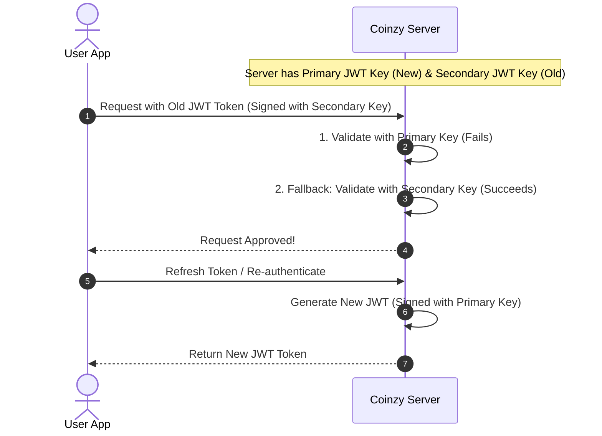

# Security Policy & Secret Management Guide

This document defines the security policies, secret injection strategies, and secret rotation procedures for the Coinzy repository to ensure credentials are never leaked and are managed securely across all environments.

---

## 1. Secret Management Policy

> [!WARNING]
> **NEVER commit plain-text credentials, API keys, private keys, or `.env` files to source control.** 
> All environment configuration files containing sensitive credentials (e.g., `.env`) must be added to `.gitignore`.

### Key Security Safeguards
1. **No Production Fallbacks**: The Coinzy server checks if it is running in `production` mode and will crash on startup if default fallback JWT keys or placeholders are detected.
2. **Template Environments**: Always use [.env.example](file:///c:/Users/Lishanth-Desktop/Desktop/Coinzy/.env.example) and [server/.env.example](file:///c:/Users/Lishanth-Desktop/Desktop/Coinzy/server/.env.example) to share variable schemas with developers.
3. **Automated Leak Detection**: It is recommended to use Gitleaks or Trufflehog in CI/CD pipelines and pre-commit hooks to detect committed secrets automatically.

---

## 2. Secret Vault Integration & Environment Injection

For production environments, Coinzy relies on external secret providers to inject secrets securely at runtime.

### Recommended Tool: Doppler (Secret Vault)
[Doppler](https://www.doppler.com/) provides a centralized dashboard to sync secrets across developer machines, GitHub Actions, AWS, Vercel, and Docker.

#### Developer Setup (Local)
1. Install Doppler CLI:
   ```bash
   # Windows (Scoop)
   scoop bucket add doppler https://github.com/DopplerHQ/scoop-doppler.git
   scoop install doppler
   
   # macOS (Homebrew)
   brew install dopplerhq/cli/doppler
   ```
2. Authenticate and select your project:
   ```bash
   doppler login
   doppler setup
   ```
3. Run the applications using Doppler injection (no `.env` file needed):
   ```bash
   # For backend:
   doppler run -- node server/server.js
   ```

---

### Alternative: HashiCorp Vault
For enterprise deployments, you can inject secrets via HashiCorp Vault.

1. **Vault Agent Sidecar Injection** (for Kubernetes):
   Configure your deployment annotations to automatically fetch secrets and write them to a shared volume (e.g., `/vault/secrets/config` as environment variables).
2. **Vault Env Helper**:
   Prefix your start script with the `vault-env` binary or wrapper to fetch secrets dynamically upon startup:
   ```bash
   vault kv get -format=json secret/coinzy/production | vault-env npm start
   ```

---

### Alternative: GitHub Secrets (CI/CD)
To inject secrets during testing, build processes, or automated deployments:
1. Navigate to your GitHub repository -> **Settings** -> **Secrets and variables** -> **Actions**.
2. Define the secrets (e.g., `DB_PASSWORD`, `JWT_SECRET`).
3. Reference them in your GitHub Actions workflow:
   ```yaml
   steps:
     - name: Build Application
       env:
         JWT_SECRET: ${{ secrets.JWT_SECRET }}
       run: npm run build
   ```

---

## 3. Zero-Downtime Secret Rotation Guide

Rotating secrets regularly minimizes the window of opportunity for attackers if a secret is compromised. Follow these procedures to perform rotations with **zero downtime**.

### Strategy 1: JWT Secret Rotation (Dual-Key Verification)
To rotate JWT signing keys without logging out active users, implement a dual-key validation window.



#### Action Steps:
1. **Define two keys in the Vault/Environment**:
   - `JWT_PRIMARY_SECRET` (the new key used to sign new tokens)
   - `JWT_SECONDARY_SECRET` (the old key used to verify existing sessions)
2. **Modify Server Verification Logic**:
   - Change your token authentication middleware to first attempt verification using `JWT_PRIMARY_SECRET`.
   - If verification fails with a `JsonWebTokenError`, try verifying using `JWT_SECONDARY_SECRET`.
   - If that succeeds, process the request normally.
3. **Promote the Primary Key**:
   - Let's say `Key_B` is current.
   - Step A: Set `JWT_SECONDARY_SECRET = Key_B` and `JWT_PRIMARY_SECRET = Key_C` (new key).
   - Step B: Deploy the update. The server now signs all new tokens with `Key_C` but accepts `Key_B`.
   - Step C: After the token expiration duration has passed (e.g., 15 minutes for access tokens, 7 days for refresh tokens), remove `JWT_SECONDARY_SECRET` entirely.

---

### Strategy 2: Database Password Rotation
To rotate database credentials without app interruptions, MySQL/PostgreSQL support dual-password active states.

1. **Create a Secondary Database User/Password**:
   - Keep the existing user active. Create or alter the database user to support a secondary password (e.g., `ALTER USER 'coinzy_app'@'%' IDENTIFIED BY 'new_password' RETAIN CURRENT PASSWORD;` in MySQL 8.0+).
2. **Update Secret Vault**:
   - Replace the database password in your Vault (Doppler / HashiCorp Vault) with the `new_password`.
3. **Trigger Rolling Deployment**:
   - Restart the server containers/processes. They will pull the updated environment variable and start using the `new_password`.
   - Old instances still running will continue to connect using the old password.
4. **Discard the Old Password**:
   - Once all containers are updated and active database connections are transitioned, revoke the old password (e.g., `ALTER USER 'coinzy_app'@'%' DISCARD OLD PASSWORD;`).

---

## 4. Guardrails: Pre-commit Security Hook
Configure your local environment to block commits that contain secrets.

### Setup Gitleaks Hook
1. Install `pre-commit`:
   ```bash
   pip install pre-commit
   ```
2. Create a `.pre-commit-config.yaml` file in the root:
   ```yaml
   repos:
     - repo: https://github.com/gitleaks/gitleaks
       rev: v8.18.2
       hooks:
         - id: gitleaks
   ```
3. Install the hooks:
   ```bash
   pre-commit install
   ```
This will automatically scan files staged for commit and block the commit if any keys or secrets are identified.
